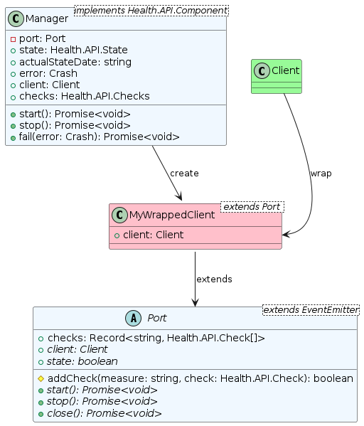
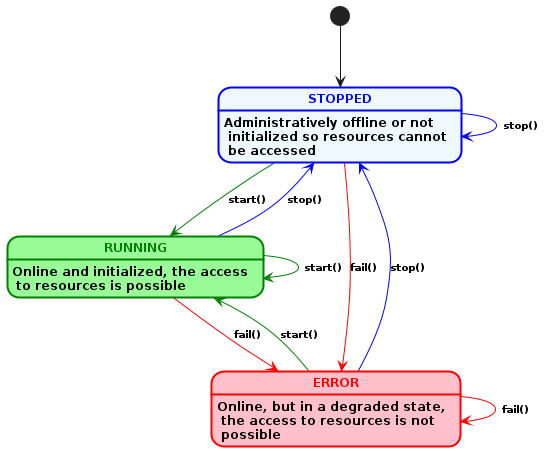
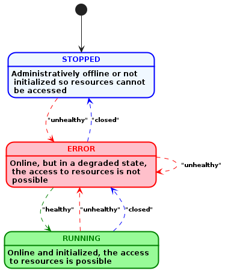

# **@mdf.js/core**

[](https://nodejs.org/en/)
[](https://www.typescriptlang.org/)
[](https://snyk.io/package/npm/snyk)
[](https://mytracontrol.github.io/mdf.js/)

<!-- markdownlint-disable MD033 MD041 -->

<p align="center">
  <div style="text-align:center;background-image:radial-gradient(circle farthest-corner at 50% 50%, #104c60, #0c0c13);">
    
  </div>
</p>

<h1 style="text-align:center;margin-bottom:0">Mytra Development Framework - @mdf.js/core</h1>
<h5 style="text-align:center;margin-top:0">Core module with shared components for resource management and instrumentation API</h5>

<!-- markdownlint-enable MD033 -->

***

## **Table of contents**

- [**@mdf.js/core**](#mdfjscore)
  - [**Table of contents**](#table-of-contents)
  - [**Introduction**](#introduction)
  - [**Installation**](#installation)
  - [***`Health`* Interface**](#health-interface)
  - [***`Layer.App`* Interface**](#layerapp-interface)
  - [***`Layer.Provider`* API**](#layerprovider-api)
    - [I Want to Use an Already Instrumented `Provider`](#i-want-to-use-an-already-instrumented-provider)
    - [I want to instrument a `Provider` with this API](#i-want-to-instrument-a-provider-with-this-api)
      - [**1. Extendiendo la clase `Port`**](#1-extendiendo-la-clase-port)
      - [**2. Defining the `PortConfigValidationStruct` object**](#2-defining-the-portconfigvalidationstruct-object)
      - [**3. Using the `ProviderFactoryCreator` function**](#3-using-the-providerfactorycreator-function)
      - [**Small and simple example**](#small-and-simple-example)
        - [*port.ts*](#portts)
        - [*config.ts*](#configts)
        - [*factory.ts*](#factoryts)
        - [*index.ts*](#indexts)
  - [***`Jobs`* API**](#jobs-api)
    - [Customization of Generic Types](#customization-of-generic-types)
    - [***`JobHandler`* Class**](#jobhandler-class)
  - [**License**](#license)

## **Introduction**

The **@mdf.js/core** module is a set of types, interfaces, and classes that standardize the way in which the state of the resources managed by the applications developed with **@mdf.js** is reported. This module is part of the **@mdf.js** ecosystem, which aims to provide a set of tools and libraries that facilitate the development of applications in Node.js, especially those that require a high level of observability and monitoring.

The **@mdf.js/core** module is composed of the following elements:

- The `Health` interface, which is a set of types and interfaces that standardize the way in which the state of the resources is reported.
- The `Layer` namespace, which contains the following elements:
  - The `App` interface, which is a set of types and interfaces that standardize the components of an application from the observability point of view.
  - The `Provider` API, which allows for the instrumentation of resource providers (databases, publish/subscribe services, etc.) so they can be managed in a standardized way within the **@mdf.js** API, especially in terms of observability, configuration management, and resource provider state management.
- The `Jobs` API, which allows for the creation and management of jobs in a standardized way within the **@mdf.js** API.

## **Installation**

To install the **@mdf.js/core** module, you can use the following commands:

- **npm**

```shell
npm install @mdf.js/core
```

- **yarn**

```shell
yarn add @mdf.js/core
```

## ***`Health`* Interface**

The `Health` interface is a set of types and interfaces that standardize the way in which the state of the resources managed by the `Provider` is reported. The `Health` interface is composed of the following types and interfaces:

- `Status`: a type that represents the status of a resource, which can be one of the following values:
  - `pass`: indicates that the resource is in a normal operating state.
  - `fail`: indicates that the resource is in an error state.
  - `warn`: indicates that the resource is in a warning state.
- `Check<T>`: an interface that defines the structure of a check object, with the following properties:
  - `componentId`: a unique identifier for an instance of a specific sub-component/dependency of a service in [UUID v4](https://en.wikipedia.org/wiki/Universally_unique_identifier) format. Multiple objects with the same `componentId` may appear in the details if they are from different nodes.
  - `componentType`: an optional string that SHOULD be present if `componentName` is present. It indicates the type of the component, which could be a pre-defined value from the spec (such as `component`, `datastore`, or `system`), a common and standard term from a well-known source (like schema.org, IANA, or microformats), or a URI indicating extra semantics and processing rules.
  - `observedValue`: an optional property that could be any valid JSON value (such as a string, number, object, array, or literal). The type is referenced by `T` in the interface definition.
  - `observedUnit`: an optional string that SHOULD be present if `metricValue` is present. It could be a common and standard term from a well-known source or a URI indicating extra semantics and processing rules.
  - `status`: a value of type `Status` indicating whether the service status is acceptable or not.
  - `affectedEndpoints`: an optional array of strings containing URI Templates as defined by \[RFC6570], indicating which particular endpoints are affected by the check.
  - `time`: an optional string indicating the date-time, in ISO8601 format, at which the reading of the `metricValue` was recorded.
  - `output`: an optional property containing raw error output in case of “fail” or “warn” states. This field SHOULD be omitted for “pass” state.
  - `links`: an optional object containing link relations and URIs \[RFC3986] for external links that may contain more information about the health of the endpoint. This includes potentially a “self” link, which may be used by clients to check health via HTTP response code.
  - ... and any other property that the `Provider` developer considers necessary to provide more information about the check.
- `Checks`: The "checks" object within the health check model allows for the representation of the health status of various logical sub-components of a service. This flexible structure is designed to accommodate the complexities of modern distributed systems, where each component may consist of multiple nodes, each potentially exhibiting a different health status. Here's a breakdown of how the "checks" object is structured and the semantics of its keys and values:

  - Each key in the "checks" object represents a logical sub-component of the service. The uniqueness of each key ensures that the health status of each sub-component can be individually assessed and reported.
  - The value associated with each key is an array of `Check` objects. This array accommodates scenarios where a single logical sub-component is supported by multiple nodes. For single-node sub-components, or when the distinction between nodes is not relevant, a single-element array is used for consistency.
  - The key for each sub-component is a unique string within the "details" section of the health check model. It may consist of two parts, separated by a colon (`:`): `{componentName}:{metricName}`. The structure of these keys is as follows:
    - `componentName`: This part of the key provides a human-readable identifier for the component. It must not contain a colon, as the colon serves as the delimiter between the component name and the metric name.
    - `metricName`: This part specifies the particular metric for which the health status is reported. Like the component name, it must not contain a colon. The metric name can be a pre-defined value specified by the health check model (such as "utilization," "responseTime," "connections," or "uptime"), a common term from a recognized standard or organization (like schema.org, IANA, or microformats), or a URI that conveys additional semantics and processing rules associated with the metric.

  The `Checks` type is defined to capture this structure, where each entry in the object maps to an array of `Check` objects, allowing for a detailed and nuanced representation of the health status across different parts of a service and its underlying infrastructure.

  ```typescript
  export type Checks<T = any> = {
    [entry in CheckEntry]: Check<T>[];
  };
  ```

And finally, the `Health` export an auxiliary method `overallStatus` that determine the `Status` of the component based on the `Checks` object.

```typescript
function overallStatus(checks: Checks): Status 
```

## ***`Layer.App`* Interface**

The `App` interface is a set of types and interfaces that standardize the way in which the state of the application is reported. The `App` API define 3 different types of components from the observability point of view:

- `Component`: a component is any part of the system that has a own identity and can be monitored for error handling. The only requirement is to emit an error event when something goes wrong, to have a name and unique component identifier.

  ```typescript
  /** Component */
  export interface Component extends EventEmitter {
    /** Emitted when the component throw an error*/
    on(event: 'error', listener: (error: Crash | Error) => void): this;
    /** Component name */
    name: string;
    /** Component identifier */
    componentId: string;
  }
  ```

  This interface define:

  - **Properties**:
    - `name`: the name of the component, this name is used by the observability layers to identify the component.
    - `componentId`: a unique identifier for the instance in [UUID v4](https://en.wikipedia.org/wiki/Universally_unique_identifier) format.
  - **Events**:
    - `on('error', listener: (error: Crash | Error) => void): this`: event emitted every time the `Component` emits an error.

- `Resource`: a resource is extended component that represent the access to an external/internal resource, besides the error handling and identity, it has a start, stop and close methods to manage the resource lifecycle. It also has a checks property to define the checks that will be performed over the resource to achieve the resulted status. The most typical example of a resource are the `Provider` that allow to access to external databases, message brokers, etc.

  ```typescript
  /** Resource */
  export interface Resource extends Component {
    /** Emitted when the component throw an error*/
    on(event: 'error', listener: (error: Crash | Error) => void): this;
    /** Emitted on every status change */
    on(event: 'status', listener: (status: Status) => void): this;
    /** Checks performed over this component to achieve the resulted status */
    checks: Checks;
    /** Resource status */
    status: Status;
    /** Resource start function */
    start: () => Promise<void>;
    /** Resource stop function */
    stop: () => Promise<void>;
    /** Resource close function */
    close: () => Promise<void>;
  }
  ```

  Besides the `Component` properties and events, this interface define:

  - **Properties**:
    - `checks`: list of checks performed by the component to determine its state. It is a list of objects of type `Health.Checks`.
    - `status`: the current status of the `Resource`. It is a variable of type `Health.Status` whose value can be:
      - `pass`: indicates that the `Resource` is in a normal operating state. If all the checks are in `pass` state, the `Resource` will be in `pass` state.
      - `fail`: indicates that the `Resource` is in an error state. If any of the checks are in `fail` state, the `Resource` will be in `fail` state.
      - `warn`: indicates that the `Resource` is in a warning state. If any of the checks are in `warn` state, the `Resource` will be in `warn` state.
  - **Methods**:
    - `start(): Promise<void>`: initialize the `Resource`, internal jobs, external dependencies connections ....
    - `stop(): Promise<void>`: stops the `Resource`, close connections, stop internal jobs, etc.
    - `close(): Promise<void>`: closes the `Resource`, release resources, destroy connections, etc.
  - **Events**:
    - `on('status', listener: (status: Health.Status) => void): this`: event emitted every time the `Resource` changes its state.

- `Service`: a service is a special kind of resource that besides `Resource` properties, it could offer:

  - Its own REST API endpoints, using an express router, to expose details about service.
  - A links property to define the endpoints that the service expose.
  - A metrics property to expose the metrics registry where the service will register its own metrics. This registry should be a [prom-client](https://www.npmjs.com/package/prom-client) registry.

  ```typescript
  /** Service */
  export interface Service extends Resource {
    /** Express router */
    router?: Router;
    /** Service base path */
    links?: Links;
    /** Metrics registry */
    metrics?: Registry;
  }
  ```

  Besides the `Resource` properties, methods and events, this interface define:

  - **Properties**:
    - `router`: an express router that will be used to expose the service endpoints.
    - `links`: an object containing link relations and URIs \[RFC3986] for external links that may contain more information about the health of the endpoint. This includes potentially a “self” link, which may be used by clients to check health via HTTP response code.
    - `metrics`: a metrics registry that will be used to register the service metrics. This registry should be a [prom-client](https://www.npmjs.com/package/prom-client) registry.

## ***`Layer.Provider`* API**

The `Provider` API of **@mdf.js** allows for the instrumentation of resource providers (databases, publish/subscribe services, etc.) so they can be managed in a standardized way within the **@mdf.js** API, especially in terms of:

- Observability, as all ***Providers*** implement the [`Layer.App.Resource`](https://www.npmjs.com/package/@mdf.js/observability) interface.
- Configuration management, providing an interface for managing default, specific, or environment variable-based configurations.
- Resource provider state management, through the standardization of the states and operation modes of the ***Providers***.

Some examples of providers instrumented with this API are:

- [**@mdf.js/mongodb-provider**](https://www.npmjs.com/package/@mdf.js/mongo-provider)
- [**@mdf.js/redis-provider**](https://www.npmjs.com/package/@mdf.js/redis-provider)
- [**@mdf.js/elastic-provider**](https://www.npmjs.com/package/@mdf.js/elastic-provider)

### I Want to Use an Already Instrumented `Provider`

A provider that has been correctly instrumented with **@mdf.js/core** API always offers a `Factory` class with a single static method `create` that allows creating new instances of the provider with the desired configuration for each case.

This `create` method **may** receive a configuration object with the following optional properties:

- `name`: the name of the provider that will be used for observability, if not specified, the default provider name will be used.
- `logger`: a `LoggerInstance` object, belonging to the **@mdf.js/logger** module or any other object that implements the `LoggerInstance` interface. If specified, it will be used by both the `Provider` and the `Port` it wraps. If not specified, a [DEBUG](https://www.npmjs.com/package/debug) type logger will be used with the provider's name indicated in the `name` property, or if not specified, with the default provider name.
- `config`: specific configuration object for the module wrapped by the `Provider` in question. If not specified, the default configuration set by the `Provider` developer will be used.
- `useEnvironment`: this property can be a boolean or a string, with its default value being `false`. It can take the following values:
  - `boolean`:
    - `true`: indicates that the environment variables defined by the `Provider` developer should be used, combined with the `Provider`'s default values and the configuration passed as an argument. The configuration is established in this order of priority: first, the arguments provided directly are taken into account, then the configurations defined in the system's environment variables, and lastly, if none of the above is available, the default values are applied.
    - `false`: indicates that the environment variables defined by the `Provider` developer should NOT be used, only the default values will be combined with the configuration passed as an argument. In this case, the configuration is established in this order of priority: first, the arguments provided directly are taken into account, and then the default values.
  - `string`: if a string is passed, it will be used as a prefix for the environment configuration variables, represented in [`SCREAMING_SNAKE_CASE`](https://en.wikipedia.org/wiki/Snake_case), which will be transformed to `camelCase` and combined with the rest of the configuration, except with the environment variables defined by the `Provider` developer. In this case, the configuration is established in this order of priority: first, the arguments provided directly are taken into account, then the configurations defined in the system's environment variables, and lastly, if none of the above is available, the default values are applied.

> **Note**: The aim of this configuration handling is to allow the user to work in two different modes:
>
> - *User rules*: the user sets their own configuration, disregarding the environment variables indicated by the `Provider` developer, with the alternative of being able to use a fast track of environment variables usage through a prefix. That is: `useEnvironment: false` or `useEnvironment: 'MY_PREFIX_'`.
> - *Provider rules*: the user prefers to use the environment variables defined by the `Provider` developer, in which case the management of the environment variables should be delegated to the `Provider`, allowing the user to set specific configuration values through the input argument, an attempt to create a **mixed** configuration where both the `Provider` and the service/application try to use environment variables, can lead to undesirable situations. That is: `useEnvironment: true`.

```typescript
import { Mongo } from '@mdf.js/mongo-provider';
// Using only `Provider` default values:
// - [x] `Provider` default values
// - [] `Provider` environment variables
// - [] User custom values
// - [] Parsing of environment variables
const myProvider = Mongo.Factory.create();
// Using `Provider` default values and custom values:
// - [x] `Provider` default values
// - [] `Provider` environment variables
// - [x] User custom values
// - [] Parsing of environment variables
const myProvider = Mongo.Factory.create({
  config: {
    url: 'mongodb://localhost:27017',
    appName: 'myName',
  },
});
const myProvider = Mongo.Factory.create({
  config: {
    url: 'mongodb://localhost:27017',
    appName: 'myName',
  },
  useEnvironment: false
});
// Using `Provider` default values, custom values and `Provider` environment variables:
// - [x] `Provider` default values
// - [x] `Provider` environment variables
// - [x] User custom values
// - [] Parsing of environment variables
const myProvider = Mongo.Factory.create({
  config: {
    url: 'mongodb://localhost:27017',
    appName: 'myName',
  },
  useEnvironment: true
});
// Using `Provider` default values, custom values and `Provider` environment variables with a prefix:
// - [x] `Provider` default values
// - [] `Provider` environment variables
// - [x] User custom values
// - [x] Parsing of environment variables
const myProvider = Mongo.Factory.create({
  config: {
    url: 'mongodb://localhost:27017',
    appName: 'myName',
  },
  useEnvironment: 'MY_PREFIX_'
});
```

Now that we have our provider instance, let's see what it offers:

- **Properties**:
  - `componentId`: a unique identifier for the instance in [UUID v4](https://en.wikipedia.org/wiki/Universally_unique_identifier) format.
  - `name`: the name of the provider, by default, set by the Provider developer or the name provided in the configuration.
  - `config`: the resulting configuration that was used to create the instance.
  - `state`: the current state of the `Provider`. It is a variable of type `ProviderState` whose value can be:
    - `running`: indicates that the `Provider` is in a normal operating state.
    - `stopped`: indicates that the `Provider` has been stopped or has not been initialized.
    - `error`: indicates that the `Provider` has encountered an error in its operation.
  - `error`: in case the `Provider` is in an error state, this property will contain an object with the error information. This property is of type `ProviderError`, which is a type alias for `Crash | Multi | undefined`, you can find more information about `Crash` and `Multi` types in the documentation of [**@mdf.js/crash**](https://www.npmjs.com/package/@mdf.js/crash).
  - `date`: the date in ISO 8601 format of the last update of the `Provider`'s state.
  - `checks`: list of checks performed by the `Provider` to determine its state. It is a list of objects of type `Health.Checks`, which will contain at least one entry with the information of the state check of the `Provider` under the property `[${name}:status]` where `${name}` is the name of the `Provider`, indicated in the configuration or by default. This field will contain an array with a single object of type `Health.Check` that will contain the information of the state check of the `Provider`. Example value of checks:

    ```ts
    {
      "myName:status": [
        {
          "status": "pass", // "pass" | "fail" | "warn"
          "componentId": "00000000-0000-0000-0000-000000000000", // UUID v4
          "componentType": "connection", // or any other type indicated by the `Provider` developer
          "observedValue": "running", // "running" | "stopped" | "error"
          "time": "2024-10-10T10:10:10.000Z",
          "output": undefined, // or the information of the error property
        }
      ]
    }
    ```

    The `Provider` developer can add more checks to the list of `checks` to provide more information about the state of the `Provider` or the resources it manages.
  - `client`: instance of the client/resource wrapped by the `Provider` that has been created with the provided configuration.

> **Note**: the instance returned by the `create` method is an instance of `Provider` with generic types for the `config` (`PortConfig`) and `client` (`PortClient`) properties, which should be extended by the Provider developer to provide a better usage experience, so that the user can know both the configuration and the client that is being used, as well as the client that has been wrapped.

- **Methods**:
  - `async start(): Promise<void>`: starts the `Provider` and the resource it wraps.
  - `async stop(): Promise<void>`: stops the `Provider` and the resource it wraps.
  - `async fail(error: Crash | Error): Promise<void>`: sets the `Provider` in an error state and saves the error information.
- **Events**:
  - `on('error', listener: (error: Crash | Error) => void): this`: event emitted every time the `Provider` emits an error.
  - `on('status', listener: (status: Health.Status) => void): this`: event emitted every time the `Provider` changes its state.

### I want to instrument a `Provider` with this API

To instrument a provider with the **@mdf.js/core** `Provider` API, the following actions must be taken:

- Use the abstract class `Port`, provided by the API, which must be extended by the `Provider` developer.
- Define the properties of the `PortConfigValidationStruct` object, which indicate the default values of the `Provider`, the values coming from environment variables, and the validation object of type 'Schema' from the [Joi](https://www.npmjs.com/package/joi) module.
- Use the `ProviderFactoryCreator` function to create an instance of the `Provider`, the class of type *Mixin* that standardizes the creation of `Provider` instances with the desired configuration.

Let's see point by point how the instrumentation of a `Provider` is carried out.

#### **1. Extendiendo la clase `Port`**

The `Port` should be extended to implement a new specific Port. This class implements some util logic to facilitate the creation of new Ports, for this reason is exposed as abstract class, instead of an interface. The developer should keep the constructor signature, in order to maintain the compatibility with the `ProviderFactoryCreator` function.



The basic operations that already implemented in the class are:

- **Properties**:
  - `uuid`: create by the `Port` class, it is a unique identifier for the port instance, this uuid is used in error traceability.
  - `name`: the name of the port, by default, set by the Provider developer or the name provided in the configuration.
  - `config`: the resulting configuration that was used to create the `Port` instance.
  - `logger`: a `LoggerInstance` object, belonging to the **@mdf.js/logger** module or any other object that implements the `LoggerInstance` interface. This property is used to log information about the port and the resources it manages. The `Port` class set the context of the logger to the port `name` and the `uuid`, so it's not necessary to include the context and the uuid of the port in the log messages.
  - `checks`: list of checks performed by the `Port` by the use of `addCheck` method, these checks are collected by the `Provider`, together with the own check of `status`, and offered to the observability layers.

> **Note**: As the signature of the `Port` constructor should maintained:
>
> ```typescript
> constructor(config: PortConfig, logger: LoggerInstance, name: string)
> ```
>
> Your `Port` class extension will receive the `config`, `logger` and `name` properties, and you should call the `super` constructor with these properties.

What the developers of the `Provider` should develop in their own `Port` class extension is:

- `async start(): Promise<void>` method, which is responsible initialize or stablish the connection to the resources.
- `async stop(): Promise<void>` method, which is responsible stop services or disconnect from the resources.
- `async close(): Promise<void>` method, which is responsible to destroy the services, resources or perform a simple disconnection.
- `state` property, a boolean value that indicates if the port is connected (true) or healthy (true) or not (false).
- `client` property, that return the ***PortClient*** instance that is used to interact with the resources.

In the next example you can see the expected behavior of a `Port` class extension when the `start`, `stop` and `close` methods are called depending on the state of the port:¡.



In the other hand, this class extends the `EventEmitter` class, so it's possible to emit events to notify the status of the port:

- `on('error', listener: (error: Crash) => void): this`: should be emitted to notify errors in the resource management or access, this will not change the provider state, but the error will be registered in the observability layers.
- `on('closed', listener: (error?: Crash) => void): this`: should be emitted if the access to the resources is not longer possible. This event should not be emitted when `stop` or `close` methods are used. If the event includes an error, the provider will indicate this error as the cause of the port closure and will be registered in the observability layers.
- `on('unhealthy', listener: (error: Crash) => void): this`: should be emitted when the port has limited access or no access to the resources, but the provider is still running and trying to recover the access. If the event includes an error, the provider will indicate this error as the cause of the port unhealthiness and will be registered in the observability layers.
- `on('healthy', listener: () => void): this`: should be emitted when the port has recovered the access to the resources.



Check some examples of implementation in:

- [Elastic provider](https://www.npmjs.com/package/@mdf.js/elastic-provider)
- [Mongo Provider](https://www.npmjs.com/package/@mdf.js/mongo-provider)

#### **2. Defining the `PortConfigValidationStruct` object**

The `PortConfigValidationStruct` object is a type that defines the default values of the `Provider`, the values coming from environment variables, and the validation object of type 'Schema' from the [Joi](https://www.npmjs.com/package/joi) module.

The `PortConfigValidationStruct` object should have the following properties:

- `defaultConfig`: an object with the default values of the `Provider`.
- `envBaseConfig`: an object with the environment variables that the `Provider` will use, if any.
- `schema`: a Joi schema object that will be used to validate the configuration object passed to the `Provider`.

```typescript
import Joi from 'joi';

export const PortConfigValidationStruct = {
  defaultConfig: {
    url: 'mongodb://localhost:27017',
    appName: 'myName',
  },
  envBaseConfig: {
    url: process.env['MONGO_URL'],
    appName: process.env['MONGO_APP_NAME'],
  },
  schema: Joi.object({
    url: Joi.string().uri().required(),
    appName: Joi.string().required(),
  }),
};
```

#### **3. Using the `ProviderFactoryCreator` function**

The `ProviderFactoryCreator` function is a utility function that allows creating instances of the `Provider` with the desired configuration. This function receives the following arguments:

- `port`: the class that extends the `Port` class and implements the specific `Provider`.
- `validation`: the `PortConfigValidationStruct` object that defines the default values, environment variables, and the validation schema of the `Provider`.
- `defaultName`: the default name of the `Provider`, so that it will be used if the name is not provided in the configuration.
- `type`: the type of the `Provider`, which will be used to identify the kind of `Provider` in the observability layers.

```typescript
const Factory = ProviderFactoryCreator(MongoPort, myConfig, 'Mongo', 'database');
```

The `Factory` object returned by the `ProviderFactoryCreator` function has a single static method `create` that allows creating new instances of the `Provider` with the desired configuration for each case.

#### **Small and simple example**

##### *port.ts*

```typescript
import { Layer } from '@mdf.js/core';
import { LoggerInstance } from '@mdf.js/logger';
import { CONFIG_PROVIDER_BASE_NAME } from '../config';
import { Client, Config } from './types';

export type Client = Console;
export type Config = {}

export class Port extends Layer.Provider.Port<Client, Config> {
  /** Client handler */
  private readonly instance: Client;
  /** */
  private interval: NodeJS.Timeout;
  /**
   * Implementation of functionalities of an HTTP client port instance.
   * @param config - Port configuration options
   * @param logger - Port logger, to be used internally
   * @param name - Port name, to be used in the logger
   */
  constructor(config: Config, logger: LoggerInstance, name: string) {
    super(config, logger, name);
    this.instance = console;
    this.interval = setInterval(this.myCheckFunction, 1000);
  }
  /** Stupid check function */
  private readonly myCheckFunction = (): void => {
    // Check the client status
    this.addCheck('myCheck', {
      status: 'pass',
      componentId: this.uuid,
      componentType: 'console',
      observedValue: 'im stupid',
      time: new Date().toISOString(),
    });
    // Emit the status event
    this.emit('healthy');
  }
  /** Return the underlying port instance */
  public get client(): Client {
    return this.instance;
  }
  /** Return the port state as a boolean value, true if the port is available, false in otherwise */
  public get state(): boolean {
    return true;
  }
  /** Initialize the port instance */
  public async start(): Promise<void> {
    // Nothing to do is a stupid port
  }
  /** Stop the port instance */
  public async stop(): Promise<void> {
    // Nothing to do is a stupid port
  }
  /** Close the port instance */
  public async close(): Promise<void> {
    // Nothing to do is a stupid port
  }
}
```

##### *config.ts*

```typescript
import { Layer } from '@mdf.js/core';
import { Config } from './port';
import Joi from 'joi';

export const config: Layer.Provider.PortConfigValidationStruct<Config> = {
  defaultConfig: {},
  envBaseConfig: {},
  schema: Joi.object({}),
};
```

##### *factory.ts*

```typescript
import { Layer } from '@mdf.js/core';
import { configEntry } from '../config';
import { Port, Client, Config } from './port';

export const Factory = Layer.Provider.ProviderFactoryCreator<Client, Config, Port>(
  Port,
  configEntry,
  `myConsole`,
  'console'
);
```

##### *index.ts*

```typescript
import { Factory } from './factory';

const myProvider = Factory.create();
myProvider.instance.log('Hello world!');
console.log(myProvider.state); // true
console.log(myProvider.checks); // { "myConsole:status": [{ status: 'pass', ... }], { "myConsole:myCheck": [{ status: 'pass', ... }] }
myProvider.on('healthy', () => {
  console.log('Im healthy');
});
```

## ***`Jobs`* API**

The `Jobs` API from **@mdf.js** allows for the management of job requests and executions within an `@mdf.js` application in a simplified and standardized way. The two main elements of this API are:

- The `JobHandler` class, which is responsible for *"transporting"* the information of the jobs to be executed, as well as notifying the execution thereof through events to interested observers.
- The `JobRequest` interface defines the structure of job requests.

```typescript
class JobHandler<
    Type extends string = string,
    Data = unknown,
    CustomHeaders extends Record<string, any> = NoMoreHeaders,
    CustomOptions extends Record<string, any> = NoMoreOptions,
  >;
interface JobRequest<
    Type extends string = string,
    Data = unknown,
    CustomHeaders extends Record<string, any> = NoMoreHeaders,
    CustomOptions extends Record<string, any> = NoMoreOptions,
  >;
```

### Customization of Generic Types

Both the class, `JobHandler`, and the interface, `JobRequest` use generic types to define the structure of the data transported in the jobs, as well as to define the custom headers and options that can be added to the jobs. In this way, the `Jobs` API is flexible and can be used in different contexts and with different types of data. The generic parameters for the `JobHandler` class and the `JobRequest` interface are as follows:

- `Type`: a string type representing the type or types of job to be executed. This string type can be used to filter the jobs to be executed, so that only jobs of a specific type are executed, or to apply different execution logic depending on the job type. For example, it can be used to execute notification jobs: `email`, `sms`, `push`, etc, so the generic type `Type` would be declared as `type Type = 'email' | 'sms' | 'push'`.
- `Data`: a generic type representing the structure of the data transported in the jobs. This type can be any type of data, from a primitive type like a number or a string, to a complex object with multiple properties. For example, if you want to send an email, the data could be an object with the properties `to`, `subject`, and `body`.
- `CustomHeaders`: a generic type representing the custom headers that can be added to the jobs. This type must be a key-value map, where the key is a string and the value can be any type of data. These custom headers can be used to add additional information to the jobs, such as metadata, authentication information, etc. Custom headers are optional and it is not necessary to add them to the jobs if not needed. By default, the generic type `CustomHeaders` is `NoMoreHeaders`, which is a type that does not allow adding custom headers to the jobs. An example of a custom header could be an authentication header containing an access token to an external API: `{ Authorization: 'Bearer <access token>' }`.
- `CustomOptions`: a generic type representing the custom options that can be added to the jobs. This type must be a key-value map, where the key is a string and the value can be any type of data. These custom options can be used to add additional information to the jobs, such as specific configurations, execution parameters, etc. Custom options are optional and it is not necessary to add them to the jobs if not needed. By default, the generic type `CustomOptions` is `NoMoreOptions`, which is a type that does not allow adding custom options to the jobs. In addition to the custom options, there is the property `numberOfHandlers`, read the [section on the `JobHandler` class](#jobhandler-class) for more information.

An example of customizing the generic types of the `JobHandler` class and the `JobRequest` interface would be as follows:

```typescript
import { Jobs } from '@mdf.js/core';
type Type = 'email' | 'sms' | 'push';
type Data = { to: string; subject: string; body: string };
type CustomHeaders = { Authorization: string };
type CustomOptions = { retry: number };

export type MyOwnJobRequest = Jobs.JobRequest<Type, Data, CustomHeaders, CustomOptions>;
export class MyOwnJobHandler extends Jobs.JobHandler<Type, Data, CustomHeaders, CustomOptions> {}

const myHandler = new MyOwnJobHandler('multi', { to: '', body: '', subject: '' }, 'email', {
  headers: { Authorization: '' },
  retry: 0,
});

const myHandler2 = new MyOwnJobHandler({
  data: { to: '', body: '', subject: '' },
  type: 'email',
  jobUserId: '123',
  options: { headers: { Authorization: '' }, retry: 0 },
});
```

### ***`JobHandler`* Class**

Let's look in more detail at the structure of the `JobHandler` class:

- `constructor`: there are two ways to instantiate a `JobHandler`:
  - `constructor(jobRequest: JobRequest<Type, Data, CustomHeaders>)`: by using a `JobRequest` object that contains the information of the job to be executed.
  - `constructor(jobUserId: string, data: Data, type?: Type, options?: Options<CustomHeaders>)`: by using the necessary parameters to create a `JobRequest` object.
    Ultimately, both cases are equivalent, as the `JobRequest` object contains the same data as the constructor parameters. Thus, we can analyze the parameters for creation through the `JobRequest` object:
    - `type`: a string type representing the type of job to be executed. The type of this variable is of the generic type `Type`, read the section on [customization of generic types](#customization-of-generic-types) for more information.
    - `data`: a generic type representing the structure of the data transported in the jobs. The type of this variable is of the generic type `Data`, read the section on [customization of generic types](#customization-of-generic-types) for more information.
    - `options`: this parameter is optional and is used to add custom headers or options to the jobs. The type of this variable is an object containing two properties:
      - `headers`: an object containing the custom headers that will be added to the job. By default, this property is of the type `CustomHeaders`, read the section on [customization of generic types](#customization-of-generic-types) for more information.
      - `numberOfHandlers`: an integer number indicating the number of handlers that will be used to execute the job. By default, this property is `1`, which means that the job has to be confirmed, through the use of the `done` method, only once. If a value greater than `1` is set, the job has to be confirmed `n` times, where `n` is the value of `numberOfHandlers`.
    - `jobUserId`: an identifier for the job. It should be used to identify the job in the user's logic. When identifying a job, keep in mind the following:
      - Property `uuid`: each new instance of `JobHandler` has a unique identifier that can be accessed only in read mode through the property `uuid`.
      - Property `type`: indicates the type of job to be executed.
      - Property `jobUserId`: identifier of the job that should be used to identify the job in the user's logic.
        That is, we can have several jobs whose `jobUserId` is `alarmNotification`, being able to have each one of them a different `type` or not and being all instances uniquely identifiable by their `uuid`.

- **Properties**:
  - `uuid`: a unique identifier for the instance of the `JobHandler`. This identifier is read-only and is generated automatically when creating a new instance of the `JobHandler`.
  - `type`: a string type representing the type of job to be executed. This type is of the generic type `Type`, read the section on [customization of generic types](#customization-of-generic-types) for more information.
  - `jobUserId`: an identifier for the job. It should be used to identify the job in the user's logic.
  - `jobUserUUID`: is a UUID v5 hash that is generated from the `jobUserId`. This hash is read-only and is generated automatically when creating a new instance of the `JobHandler`.
  - `status`: an enumerated type of `Status` that indicates the status of the job. The possible values are:
    - `Status.PENDING`(`pending`): indicates that the job is pending execution. It is the initial state of a job.
    - `Status.PROCESSING`(`processing`): indicates that the job is being processed.
    - `Status.COMPLETED`(`completed`): indicates that the job has been completed successfully.
    - `Status.FAILED`(`failed`): indicates that the job has failed.
  - `data`: a generic type representing the structure of the data transported in the jobs. This type is of the generic type `Data`. When accessing the property for the first time, i.e., when the status is `Status.PENDING`, the job changes its status to `Status.PROCESSING`.
  - `options`: contains the options indicated in the constructor of the class.
  - `createdAt`: the creation date of the job as a `Date` object.
  - `hasErrors`: a boolean value that indicates if the job contains errors. This value is read-only and is set automatically when an error occurs in the job. These errors are included through the `done` and `addError` methods.
  - `errors`: if there are errors in the job, this property contains a `Multi` object belonging to the `@mdf.js/crash` module that contains the information of the errors. This property is read-only and is set automatically when an error occurs in the job. These errors are included through the `done` and `addError` methods.
  - `processTime`: if the job has been completed successfully, this property contains the time it took to process the job in milliseconds, otherwise, the value is `-1`.

- **Methods**:
  - `public addError(error: Crash | Multi): void`: adds an error to the job. This method is used to add errors to the job that have occurred during its execution. The errors added through this method are included in the `errors` property and the `hasErrors` property is set to `true`. The error created is of the type `ValidationError`.

  - `public done(error?: Crash): void`: finishes the job. This method is used to finish the job and change its status to `Status.COMPLETED` if no error has occurred, or to `Status.FAILED` if an error has occurred. If an error is provided, it is added to the `errors` property and the `hasErrors` property is set to `true`. This method will have to be called as many times as `numberOfHandlers` has been set in the constructor, once the number of calls is reached, the job will emit the `done` event.

  - `public result(): Result<Type>`: returns a `Result` object containing the information of the job.

    ```typescript
    /** Job result interface */
    export interface Result<Type extends string = string> {
      /** Unique job processing identification */
      uuid: string;
      /** Job type */
      type: Type;
      /** Timestamp, in ISO format, of the job creation date */
      createdAt: string;
      /** Timestamp, in ISO format, of the job resolve date */
      resolvedAt: string;
      /** Number of entities processed with success in this job */
      quantity: number;
      /** Flag that indicate that the publication process has some errors */
      hasErrors: boolean;
      /** Array of errors */
      errors?: MultiObject;
      /** User job request identifier, defined by the user */
      jobUserId: string;
      /** Unique user job request identification, based on jobUserId */
      jobUserUUID: string;
      /** Job status */
      status: Status;
    }
    ```

  - `public toObject(): JobObject<Type, Data, CustomHeaders, CustomOptions>`: returns a `JobObject` type object containing the information of the job.

    ```typescript
    /** Job object interface */
    export interface JobObject<
      Type extends string = string,
      Data = any,
      CustomHeaders extends Record<string, any> = NoMoreHeaders,
      CustomOptions extends Record<string, any> = NoMoreOptions,
    > extends JobRequest<Type, Data, CustomHeaders, CustomOptions> {
      /** Job type identification, used to identify specific job handlers to be applied */
      type: Type;
      /** Unique job processing identification */
      uuid: string;
      /** Unique user job request identification, generated by UUID V5 standard and based on jobUserId */
      jobUserUUID: string;
      ** Job status */
      status: Status;
    }
    ```

- **Events**:
  - `on(event: 'done', listener: (uuid: string, result: Result<Type>, error?: Multi) => void): this`: event emitted when the job has been completed successfully or has failed. The event returns the unique identifier of the job, the information of the job in a `Result` object type, and an error in case a failure has occurred.

## **License**

Copyright 2024 Mytra Control S.L. All rights reserved.

Use of this source code is governed by an MIT-style license that can be found in the LICENSE file or at <https://opensource.org/licenses/MIT>.
