# **@mdf.js/firehose**

[](https://nodejs.org/en/)
[](https://www.typescriptlang.org/)
[](https://snyk.io/package/npm/snyk)

<!-- markdownlint-disable MD033 MD041 -->

<p align="center">
  <div style="text-align:center;background-image:radial-gradient(circle farthest-corner at 50% 50%, #104c60, #0c0c13);">
    
  </div>
</p>

<h1 style="text-align:center;margin-bottom:0">Mytra Development Framework - @mdf.js/firehose</h1>
<h5 style="text-align:center;margin-top:0">Module designed to facilitate the creation of customized data streaming pipelines.</h5>

<!-- markdownlint-enable MD033 -->

***

## **Table of contents**

- [**@mdf.js/firehose**](#mdfjsfirehose)
  - [**Table of contents**](#table-of-contents)
  - [**Introduction**](#introduction)
  - [**Installation**](#installation)
  - [**Use**](#use)
    - [**Typing your own firehose**](#typing-your-own-firehose)
    - [**Jobs**](#jobs)
    - [**Creating a Plug**](#creating-a-plug)
      - [**Plugs.Source.Flow**](#plugssourceflow)
      - [**Plugs.Source.Sequence**](#plugssourcesequence)
      - [**Plugs.Source.CreditFlow**](#plugssourcecreditflow)
      - [**Plugs.Sink.Tap**](#plugssinktap)
      - [**Plugs.Sink.Jet**](#plugssinkjet)
    - [**Creating a Strategy**](#creating-a-strategy)
    - [**Event Handling**](#event-handling)
    - [**Firehose Configuration and Lifecycle**](#firehose-configuration-and-lifecycle)
    - [**Metrics and Health Checks**](#metrics-and-health-checks)
  - [**License**](#license)

## **Introduction**

**@mdf.js/firehose** is a robust module within the @mdf.js ecosystem, designed to create customized data streaming pipelines. It provides a versatile framework for constructing complex data processing workflows, enabling developers to define custom plugs and strategies for handling diverse data streams.

Before delving into the documentation, it’s essential to understand the core concepts within @mdf.js/firehose:

- **Plugs**: Plugs act as the endpoints of data pipelines, responsible for receiving and sending data to or from the pipeline. They adapt the data stream to the requirements of source or destination systems, aligning with each system’s flow needs. Plugs can be categorized as inputs (**Source**) or outputs (**Sink**) and vary by flow conditions supported by the connecting systems:

  - **Source**:
    - **Flow**: Plugs that allow continuous data entry; this flow can be paused or restarted based on the pipeline’s state. Typical for data streaming systems like message brokers.
    - **Sequence**: Plugs that enable data entry in a sequential flow, where the pipeline requests data in specified quantities from the plug. Common for data storage systems such as databases.
    - **CreditFlow**: Continuous flow plugs that require a credit system to receive data. Common in data streaming systems that necessitate authorization to continue receiving data.
  - **Sink**:
    - **Tap**: Plugs that process data one unit at a time, meaning the pipeline calls the plug’s write method for a single data instance. Common in systems that do not support bulk operations.
    - **Jet**: Plugs that handle data in batches, where the pipeline calls the plug’s write method with multiple data instances. Typical for systems enabling bulk processing.

- **Jobs**: Jobs are instances that transport data and metadata through the pipeline. They manage the data flow between plugs, ensuring correct processing and pipeline state maintenance. Source plugs are notified when a job completes, allowing them to “acknowledge” data from the source system. Jobs can carry additional metadata or processing information, which plugs and strategies can utilize to make decisions or perform specific actions.

- **Strategies**: Strategies provide customizable, `type`-based functions that define how to transform job-carried data. Strategies can filter, transform, enrich, or aggregate data as required. They can be chained to build complex data processing workflows, allowing developers to create tailored data pipelines.

This entire ecosystem leverages Node.js streams to build high-performance data processing pipelines capable of efficiently handling large volumes of data.



Other key features of **@mdf.js/firehose** include:

- **Error Handling**: The module provides a robust error handling mechanism, allowing developers to define custom error handling strategies for different scenarios.
- **Logging**: The module supports logging, enabling developers to track the pipeline’s execution and performance.
- **Metrics**: The module provides metrics for monitoring pipeline performance, allowing developers to track data processing efficiency and identify bottlenecks. These metrics are offered in the Prometheus format, using the `prom-client` library.
- **Multi-Threaded Processing**: The module supports multi-threaded processing, allowing developers to leverage the full potential of multi-core processors thanks to the **@mdf.js/service-registry** module.
- **Tooling**: The module provides a set of tools to facilitate the creation of custom plugs and strategies, including a plug generator and a strategy generator. These plugs could be based on the **@mdf.js** providers.

## **Installation**

```bash
npm install @mdf.js/firehose
```

```bash
yarn add @mdf.js/firehose
```

## **Use**

### **Typing your own firehose**

The `Firehose` class, along with the `Jobs`, `Plugs`, and `Strategies` classes, are generic classes that allow you to define the types of the data that will be processed by the pipeline. This is useful to ensure that the data is correctly typed throughout the pipeline.

There are four types that you can define in the `Firehose` class:

- `Type` (`Type extends string = string`): Job type, used as a selector for strategies in job processing.
- `Data` (`Data = any`): Data type that will be processed by the pipeline.
- `CustomHeaders` (`CustomHeaders extends Record<string, any> = {}`): Custom headers, used to pass specific information for job processors.
- `CustomOptions` (`CustomOptions extends Record<string, any> = {}`): Custom options, used to pass specific information for job processors.

For example, if you want to create a pipeline that processes data of type `MyData`, you can define the `Firehose` class as follows:

```typescript
import { Firehose } from '@mdf.js/firehose';

type MyJobType = 'TypeOne' | 'TypeTwo';
type MyJobDataType<T extends MyJobType> = T extends 'TypeOne'
  ? { fieldOne: string }
  : T extends 'TypeTwo'
    ? { fieldTwo: number }
    : never;
type JobHeaders = { headerOne: string };
type JobOptions = { optionOne: string };

const myFirehose = new Firehose<MyJobType, MyJobDataType<MyJobType>, JobHeaders, JobOptions>('MyFirehose', {
  sources: [/* Your source plugs */],
  sinks: [/* Your sink plugs */],
  strategies: {
    TypeOne: [/* Your strategies for TypeOne */],
    TypeTwo: [/* Your strategies for TypeTwo */],
  },
});
```

### **Jobs**

As previously mentioned, jobs are instances that transport data and metadata through the pipeline. They manage the data flow between plugs, ensuring correct processing and pipeline state maintenance. `Source` and `Sink` plugs do not use `Jobs` directly to avoid the need to create and manage them manually. Instead, they use the `JobRequest`, in the case of `Source` plugs, and the `JobObject`, in the case of `Sink` plugs.

Both of them can be typed using the `Firehose` class that we previously defined. The `JobRequest` and `JobObject` types are defined as follows:

- `JobRequest` is an object that contains the data and metadata that the `Source` plug needs to create a job.

```typescript
export interface JobRequest<
  Type extends string = string,
  Data = unknown,
  CustomHeaders extends Record<string, any> = Jobs.AnyHeaders,
  CustomOptions extends Record<string, any> = Jobs.AnyOptions,
> {
  /** Job type identification, used to identify specific job handlers to be applied */
  type?: Type;
  /** User job request identifier, defined by the user */
  jobUserId: string;
  /** Job payload */
  data: Data;
  /** Job meta information, used to pass specific information for job processors */
  options?: Jobs.Options<CustomHeaders, CustomOptions>;
}
```

An example of a `JobRequest` could be:

```typescript
const jobRequest: JobRequest<MyJobType, MyJobDataType<MyJobType>, JobHeaders, JobOptions> = {
  type: 'TypeOne',
  jobUserId: '1234',
  data: { fieldOne: 'value' },
  options: { headers: { headerOne: 'value' }, optionOne: 'value' },
};
```

- `JobObject` is an object that contains the data and metadata that the `Sink` plug needs to process a job.

```typescript
export interface JobObject<
  Type extends string = string,
  Data = any,
  CustomHeaders extends Record<string, any> = Jobs.AnyHeaders,
  CustomOptions extends Record<string, any> = Jobs.AnyOptions,
> extends JobRequest<Type, Data, CustomHeaders, CustomOptions> {
  /** Job type identification, used to identify specific job handlers to be applied */
  type: Type;
  /** Unique job processing identification */
  uuid: string;
  /**
   * Unique user job request identification, generated by UUID V5 standard and based on jobUserId
   */
  jobUserUUID: string;
  /** Job status */
  status: Jobs.Status;
}
```

An example of a `JobObject` could be:

```typescript
const jobObject: JobObject<MyJobType, MyJobDataType<MyJobType>, JobHeaders, JobOptions> = {
  type: 'TypeOne',
  uuid: 'f47ac10b-58cc-4372-a567-0e02b2c3d479',
  jobUserId: '1234',
  jobUserUUID: 'f47ac10b-58cc-4372-a567-0e02b2c3d479',
  data: { fieldOne: 'value' },
  options: { headers: { headerOne: 'value' }, optionOne: 'value' },
  status: 'pending',
};
```

> When the `Sink` plug completes processing a job (using the `single` method for `Tap` plugs or the `single`/`multi` methods for `Jet` plugs), the `Firehose` will notify the `Source` plug that the job has been processed by calling the method `postConsume` with the `jobUserId` as a parameter.

### **Creating a Plug**

The first step in building a data streaming pipeline is creating a plug. Plugs act as the endpoints of the pipeline, handling data input and output. To create a plug, you need to create your own class that implements the `Source` or `Sink` interface. All the `Source` and `Sink` interfaces extend the interface `Layer.App.Resource`, including some additional methods and events to handle the data flow.

- **Source**
  - **Events**:
    - `data`: Event that is emitted when the plug has data to be processed. The emitted data is a `JobRequest` object.
  - **Methods**:
    - `postConsume(jobId: string): Promise<string | undefined>`: Method that is called when the plug has processed a job. The parameter is the `jobUserId` of the processed job. This method must return a promise that resolves to the same `jobUserId` of the processed job or `undefined`. If `undefined` is resolved, the `Firehose` will understand that the job has not been found in the source plug due to an error. This is an important method to implement to ensure that the pipeline is working correctly by cleaning from the source (if needed) when the job has been processed.
  - **Types of Source Plugs**:
    - **Flow**:
      - `init(): void`: Method that is called when the plug is initialized and indicates that the plug can start emitting data.
      - `pause(): void`: Method that is called when the plug is paused and indicates that the plug should stop emitting data.
    - **Sequence**:
      - `ingestData(size: number): Promise<JobRequest | JobRequest[]>`: Method that is called when the plug needs to ingest data. The parameter is the quantity of data that the plug needs to ingest. This method must return a promise that resolves to a single `JobRequest` object or an array of `JobRequest` objects. It's not necessary to resolve the exact quantity of data requested, but the plug must resolve at least one `JobRequest` object. If the plug doesn't have more data to ingest, it must block the promise until it has more data to ingest.
    - **CreditFlow**:
      - `addCredits(credits: number): Promise<number>`: Method that is called to add credits to the plug. The parameter is the quantity of credits to add. This method must return a promise that resolves when the credits have been added to the plug, returning the number of credits that the plug has. Each emitted data will consume one credit. If the plug doesn't have credits, it must wait until `addCredits` is called to emit more data.

- **Sink**
  - **Methods**:
    - **Tap**:
      - `single(job: JobObject): Promise<void>`: Method that is called to process a single job.
    - **Jet**:
      - `single(job: JobObject): Promise<void>`: Method that is called to process a single job.
      - `multi(jobs: JobObject[]): Promise<void>`: Method that is called to process multiple jobs.

As a `Layer.App.Resource`, the `Plugs` should include health information in the `checks` and `status` properties. The `status` property should be `pass` if the plug is healthy and `fail` if the plug is not healthy. The `checks` property should include an array of checks that the plug must pass to be considered healthy. If you use the `@mdf.js` framework to create your plug, you can combine the provider health information with the plug health information.

#### **Plugs.Source.Flow**

```typescript
import { Plugs, JobRequest } from '@mdf.js/firehose';
import { EventEmitter } from 'events';
import { Registry } from 'prom-client';
import { Health } from '@mdf.js/core';

/** Class that implements the Plugs.Source.Flow interface */
class MySourcePlug extends EventEmitter implements Plugs.Source.Flow {
  /** Constructor */
  constructor() {
    super();
  }
  /** Method that is called when the firehose has processed a job */
  public postConsume(jobId: string): Promise<string | undefined> {
    // Implementation
  }
  /** Method that is called when the plug is initialized and indicates that the plug can start emitting data */
  public init(): void {
    // Implementation
  }
  /** Method that is called when the plug is paused and indicates that the plug should stop emitting data */
  public pause(): void {
    // Implementation
  }
  /** Start the plug and the underlying provider */
  public async start(): Promise<void> {
    // Implementation
  }
  /** Stop the plug and the underlying provider */
  public async stop(): Promise<void> {
    // Implementation
  }
  /** Stop the plug and the underlying provider and clean the resources */
  public async close(): Promise<void> {
    // Implementation
  }
  /** Prometheus registry to store the metrics of the plug */
  public get metrics(): Registry {
    // Implementation
  }
  /** Plug health status */
  public get status(): Health.Status {
    // Implementation
  }
  /** Plug health checks */
  public get checks(): Health.Checks {
    // Implementation
  }
}
```

#### **Plugs.Source.Sequence**

```typescript
import { Plugs, JobRequest } from '@mdf.js/firehose';
import { EventEmitter } from 'events';
import { Registry } from 'prom-client';
import { Health } from '@mdf.js/core';

/** Class that implements the Plugs.Source.Sequence interface */
class MySourcePlug extends EventEmitter implements Plugs.Source.Sequence {
  /** Constructor */
  constructor() {
    super();
  }
  /** Method that is called when the firehose has processed a job */
  public postConsume(jobId: string): Promise<string | undefined> {
    // Implementation
  }
  /** Method that is called when the plug needs to ingest data */
  public ingestData(size: number): Promise<JobRequest | JobRequest[]> {
    // Implementation
  }
  /** Start the plug and the underlying provider */
  public async start(): Promise<void> {
    // Implementation
  }
  /** Stop the plug and the underlying provider */
  public async stop(): Promise<void> {
    // Implementation
  }
  /** Stop the plug and the underlying provider and clean the resources */
  public async close(): Promise<void> {
    // Implementation
  }
  /** Prometheus registry to store the metrics of the plug */
  public get metrics(): Registry {
    // Implementation
  }
  /** Plug health status */
  public get status(): Health.Status {
    // Implementation
  }
  /** Plug health checks */
  public get checks(): Health.Checks {
    // Implementation
  }
}
```

#### **Plugs.Source.CreditFlow**

```typescript
import { Plugs, JobRequest } from '@mdf.js/firehose';
import { EventEmitter } from 'events';
import { Registry } from 'prom-client';
import { Health } from '@mdf.js/core';

/** Class that implements the Plugs.Source.CreditFlow interface */
class MySourcePlug extends EventEmitter implements Plugs.Source.CreditFlow {
  /** Constructor */
  constructor() {
    super();
  }
  /** Method that is called when the firehose has processed a job */
  public postConsume(jobId: string): Promise<string | undefined> {
    // Implementation
  }
  /** Method that is called to add credits to the plug */
  public addCredits(credits: number): Promise<number> {
    // Implementation
  }
  /** Start the plug and the underlying provider */
  public async start(): Promise<void> {
    // Implementation
  }
  /** Stop the plug and the underlying provider */
  public async stop(): Promise<void> {
    // Implementation
  }
  /** Stop the plug and the underlying provider and clean the resources */
  public async close(): Promise<void> {
    // Implementation
  }
  /** Prometheus registry to store the metrics of the plug */
  public get metrics(): Registry {
    // Implementation
  }
  /** Plug health status */
  public get status(): Health.Status {
    // Implementation
  }
  /** Plug health checks */
  public get checks(): Health.Checks {
    // Implementation
  }
}
```

#### **Plugs.Sink.Tap**

```typescript
import { Plugs, JobRequest } from '@mdf.js/firehose';
import { EventEmitter } from 'events';
import { Registry } from 'prom-client';
import { Health } from '@mdf.js/core';

/** Class that implements the Plugs.Sink.Tap interface */
class MySinkPlug extends EventEmitter implements Plugs.Sink.Tap {
  /** Constructor */
  constructor() {
    super();
  }
  /** Method that is called to process a single job */
  public single(job: JobObject): Promise<void> {
    // Implementation
  }
  /** Start the plug and the underlying provider */
  public async start(): Promise<void> {
    // Implementation
  }
  /** Stop the plug and the underlying provider */
  public async stop(): Promise<void> {
    // Implementation
  }
  /** Stop the plug and the underlying provider and clean the resources */
  public async close(): Promise<void> {
    // Implementation
  }
  /** Prometheus registry to store the metrics of the plug */
  public get metrics(): Registry {
    // Implementation
  }
  /** Plug health status */
  public get status(): Health.Status {
    // Implementation
  }
  /** Plug health checks */
  public get checks(): Health.Checks {
    // Implementation
  }
}
```

#### **Plugs.Sink.Jet**

```typescript
import { Plugs, JobRequest } from '@mdf.js/firehose';
import { EventEmitter } from 'events';
import { Registry } from 'prom-client';
import { Health } from '@mdf.js/core';

/** Class that implements the Plugs.Sink.Jet interface */
class MySinkPlug extends EventEmitter implements Plugs.Sink.Jet {
  /** Constructor */
  constructor() {
    super();
  }
  /** Method that is called to process a single job */
  public single(job: JobObject): Promise<void> {
    // Implementation
  }
  /** Method that is called to process multiple jobs */
  public multi(jobs: JobObject[]): Promise<void> {
    // Implementation
  }
  /** Start the plug and the underlying provider */
  public async start(): Promise<void> {
    // Implementation
  }
  /** Stop the plug and the underlying provider */
  public async stop(): Promise<void> {
    // Implementation
  }
  /** Stop the plug and the underlying provider and clean the resources */
  public async close(): Promise<void> {
    // Implementation
  }
  /** Prometheus registry to store the metrics of the plug */
  public get metrics(): Registry {
    // Implementation
  }
  /** Plug health status */
  public get status(): Health.Status {
    // Implementation
  }
  /** Plug health checks */
  public get checks(): Health.Checks {
    // Implementation
  }
}
```

### **Creating a Strategy**

Strategies provide customizable, `type`-based functions that define how to transform job-carried data. Strategies can filter, transform, enrich, or aggregate data as required. They can be chained to build complex data processing workflows, allowing developers to create tailored data pipelines.

To create a strategy, you need to create a class that implements the `Strategy` interface. The `Strategy` interface includes the following methods and properties:

- `do(process: JobHandler): Promise<JobHandler>`: Method that is called to process a job. The parameter is the `JobHandler` to process. This method must return a promise that resolves to a `JobHandler` with the processed data.
- `name: string`: Strategy name, used to identify the strategy in the pipeline.

```typescript
import { Jobs } from '@mdf.js/core';

/** Class that implements the Strategy interface */
class MyStrategy implements Jobs.Strategy {
  /** Strategy name */
  public get name(): string {
    return 'MyStrategy';
  }
  /** Method that is called to process a job */
  public async do(process: Jobs.JobHandler): Promise<Jobs.JobHandler> {
    // Process the job
    return process;
  }
}
```

### **Event Handling**

The `Firehose` class extends `EventEmitter` and emits several events that you can listen to:

- `error`: Emitted when the component detects an error.

  ```typescript
  firehose.on('error', (error) => {
    console.error('An error occurred:', error);
  });
  ```

- `status`: Emitted when the component's status changes.

  ```typescript
  firehose.on('status', (status) => {
    console.log('Firehose status:', status);
  });
  ```

- `job`: Emitted when a new job is received from a source.

  ```typescript
  firehose.on('job', (job) => {
    console.log('New job received:', job);
  });
  ```

- `done`: Emitted when a job has ended, either due to completion or failure.

  ```typescript
  firehose.on('done', (uuid, result, error) => {
    if (error) {
      console.error(`Job ${uuid} failed with error:`, error);
    } else {
      console.log(`Job ${uuid} completed with result:`, result);
    }
  });
  ```

- `hold`: Emitted when the engine is paused due to inactivity.

  ```typescript
  firehose.on('hold', () => {
    console.warn('Firehose is on hold due to inactivity.');
  });
  ```

### **Firehose Configuration and Lifecycle**

To instantiate a `Firehose`, you need to provide a name and options that include the sources, sinks, and optionally, strategies, retry options, buffer size, etc.

```typescript
import { Firehose } from '@mdf.js/firehose';

const firehose = new Firehose('MyFirehose', {
  sources: [/* Your source plugs */],
  sinks: [/* Your sink plugs */],
  strategies: {
    TypeOne: [/* Strategies for TypeOne */],
    TypeTwo: [/* Strategies for TypeTwo */],
  },
  retryOptions: /* Your retry options */,
  bufferSize: 100,
  atLeastOne: true,
  logger: /* Your logger instance */,
  maxInactivityTime: 60000,
});
```

To manage the lifecycle of the `Firehose`, you can use the following methods:

- `start(): Promise<void>`: Starts the firehose, initializing all the sources and sinks, and begins processing jobs.
- `stop(): Promise<void>`: Stops the firehose, gracefully shutting down all the sources and sinks.
- `close(): Promise<void>`: Stops the firehose and cleans up all resources.
- `restart(): Promise<void>`: Restarts the firehose, re-initializing all components.

Example:

```typescript
await firehose.start();
// Firehose is now running

// Later, when you need to stop it
await firehose.stop();
```

### **Metrics and Health Checks**

The `Firehose` class includes a Prometheus registry to store the metrics of the pipeline. As you can see in the previous examples, new metrics can be added to the plug classes. The `Firehose` instance will collect all the metrics of the plugs and will expose them in the `metrics` property of the `Firehose` instance.

The default metrics included in the `Firehose` instance are:

- `api_all_job_processed_total`: The total number of all jobs processed, with the label `type`.
- `api_all_errors_job_processing_total`: The total number of errors processing jobs, with the label `type`.
- `api_all_job_in_processing_total`: Number of jobs currently processing (no response yet), with the label `type`.
- `api_publishing_job_duration_milliseconds`: Firehose jobs duration, with the label `type`.
- `api_publishing_throughput`: Firehose throughput in bytes, with the label `type`.

On the other side, `Plugs` should include health information in the `checks` and `status` properties. This information will be grouped with the `Firehose` health information. The `status` property should be `pass` if all the checks are passing and `fail` if any check is failing.

The health information can be classified into two types: stream status (number of pending jobs in the pipeline) and recent plug operations.

You can access the health status and checks through the `status` and `checks` properties:

```typescript
const firehoseStatus = firehose.status;
const firehoseChecks = firehose.checks;
```

## **License**

Copyright 2024 Mytra Control S.L. All rights reserved.

Use of this source code is governed by an MIT-style license that can be found in the LICENSE file or at <https://opensource.org/licenses/MIT>.
